## 欲しい機能リスト

### 特に欲しい（岩垣）
- エンコーダAorBの波形から読み取った速度変化
- ドライバに出している速度指令値（Pythonのコードを元に）
- ドライバが実際に出している速度指令値（コネクタを取り付けて測定）

### できれば欲しい（岩垣）
- グリッパーの位置（開閉）を確認できるもの
- 測定している温度の変化のグラフ
- コイルの電流（U,V,W）のグラフ
- コイルの電圧（U,V,W）のグラフ
- エンコーダA,B,Zの生の波形

### 秋澤さん提案
- データをPDF,hdf5にして保存する機能（実験データ解析用）
- LabVIEWみたいに直感的に操作できるグラフ表示のUI
- SQL（試験ごとの条件をまとめて、実験データのDLもできるもの、Excelの代わり）
- ソフトトリガー

## 要件定義

### 機能要件
#### エンコーダー部
1. A相信号立上がりからの時間差計測と速度計測
    - 入力
      1. 1 rps 回転時の4逓倍信号を仮定して1パルスあたり1/2000 ~ 0.5 msの入力が可能なこと
      2. A/D変換のサンプリングレートは上記の1/10程度を仮定し0.05 ~ 0.1 msとすること。
      3. 1処理あたり0.1 ~ 0.2 sの信号を処理すること。
    - 処理
      - しきい値を超えた2つの立上がりから時間差計測をすること。
      - シュミットトリガー処理後0 V-5 Vの信号に対して2.5 V（暫定）にしきい値を設定すること。
      - しきい値を超えた次点をパルス立上がり時間とすること。
    - 出力
      - 出力データ点は5~10 points/sとすること。(入力iiに対応する)
      - データログ部との整合性を取るためDuration幅で代表値1点を取得すること（ここは後で詰める）

1. AおよびB相信号立上がりからのn逓倍パルスカウントと速度計測
    - 入力
      1. 1 rps 回転時の4逓倍信号を仮定して1/2000 ~ 0.5 msのパルス信号をカウントすること。
    - 出力
      - 出力データ点は5~10 points/sとすること。

1. 速度グラフ
    - 24時間以内~100万行のデータ描画が可能なこと。
    - モータードライバー速度指令値およびエンコーダー信号を表示すること。
    - 拡大表示機能をもつこと。

1. （デバッグ用）SiPD実信号モニター
    - AおよびB相、n逓倍信号を表示する機能をもつこと。
    - 表示時間幅は0.1 ~ 0.2 sとすること。

1. データログ
    - ソフトウェア処理後の時間差とそこから推定した速度、パルスカウントとそこから推定した速度を保存すること。
    - 保存形式はカンマ区切り形式.csvおよびバイナリ形式.hdfを選択できること。

#### 表記等
  1. 単位は工学値変換した値を用いること。

### 性能要件
#### エンコーダー部
1. AD変換部
    - AD変換器: National Instruments USB-9215
    - サンプリングレート: 10 ~ 20 kHz (0.05 ~ 0.1 msに対応する)
    - 電圧レンジ: 0 ~ 10 V
    - チャンネル同時読み出し数: 3 (A, B, Z)
    - デジタル出力: USB-2.0以上
    - データ型: 単精度実数
    - 外部トリガー: なし
    - クロック: WRITE ME
    - 通信: GPIB

2. データ処理部
    - データ型: 単精度実数
    - 保存データ用バッファ: 16 MB (単精度実数を仮定して400万行相当)
    - 速度グラフデータ用バッファ: WRITE ME (デバッグ分＋8MB)
    - メモリ開放: 明示的に10 sごとに実施する（Tentative）
    - 逓倍処理用データ配列長: WRITE ME
    - 逓倍処理用バッファ: WRITE ME

3. グラフ表示部
    - 画面リフレッシュレート: 0.1 ~ 0.2 s
    - グラフウィンドウ数: 2 (速度グラフ+デバッグ用実信号モニター)
    - グラフ描画用バッファ: 10 MB (Tentative)
    - 方式: Pykstを用いたAPI呼び出しによる描画 (Tentative)

<!-- 
- I/O
    - INPUT
        - SiPD DAQ
            - サンプリングレート: WRITE ME
            - 読み出し電圧レンジ : WRITE ME
            - 読み出しチャンネル数: WRITE ME
        - モーター電流 DAQ
            - サンプリングレート: WRITE ME
            - 読み出し電圧レンジ: WRITE ME
            - 読み出しチャンネル数: 3
        - モーター電圧 DAQ
            - サンプリングレート: WRITE ME
            - 読み出し電圧レンジ: WRITE ME
            - 読み出しチャンネル数: 3
        - 温度計 DAQ
            - サンプリングレート: WRITE ME
            - 読み出しチャンネル数: WRITE ME
    - OUTPUT
        - モータードライバコントロール
            - パラメータ
                - 励磁電流: 0 ~ 0.5 A
                - 初期電気角
                - 回転周波数: 0 ~ 5 Hz (5 rps)
                - 加速設定 (pulse per second, pps):
                    - 指令パルスインクリメント幅 (step): WRITE ME [pulse]
                    - 指令デュレーション幅 (rst): [s]
                    - 初期パルス
                - 回転方向: CW or CCW (回転方向とエンコーダー方向を定義せよ)
                - 回転前直流励磁
                    - 電流値: 0 ~ 0.5 A
                    - 時間: N/A
- データ処理
    - F/V変換
    - 
- UI
    - 画面構成
        - エンコーダー速度グラフ
        - 指令速度グラフ
        - 測定温度（クライオスタット+外部）
        - 圧力計
    - グラフ画面リフレッシュレート: WRITE ME
    - バッファーサイズ: WRITE ME
    - 画面保存機能
- データベース
    - RAWデータ
        - ファイルフォーマット: csv or HDF5?
    - 実験条件パラメータ
        - 励磁電流
        - 加速設定
        - 回転方向
        - 回転前直流励磁
    - 処理データ
        - エンコーダー速度データ
        - 指令速度データ
    - 時間:
        - UNIX時間（内部処理）とISO8601（UI）の相互型変換

- クロック: システムクロック
- ソフトウェアトリガー:
- Garbage collection
-->

## 基本設計
### 機能一覧表

- 
- 

### 論理設計

```mermaid
erDiagram
  direction LR

  %% ================== CORE ENTITIES ==================
  EXPERIMENT {
    varchar     name                 "experiment name"
    varchar     description          "notes"
    timestamptz executed_at          "command time"
  }

ENVIRONMENT {
    varchar     name                 "experiment name"
    varchar     description          "notes"
    varchar     phase                "run | env | finl"
    timestamptz start_at             "UNIX start time"
    timestamptz end_at               "UNIX end time"
  }

  %% ================== DEVICES ==================
  MotorControl {
    int         step                 "pulse inc width"
    int         rst                  "pulse dur width"
    int         pulse_total          "target pulses"
    int         current_exct         "excitation current"
    int         frequency            "steable in rpm"
    int         rot_direction        "cw/ccw"
    timestamptz exp_start_at         "UNIX start time"
    timestamptz exp_end_at           "UNIX end time"
    timestamptz stable_reached_at    "UNIX reached stable time"
    int current_step    "num of pulse"
    int current_speed   "current speed in rps"
  }

  MotorDriver {
  }

  NIDAQ_ENC {
    int mod_no "channel of Mod"
    int ch_no "channel of ai"
    int sampling_rate
    float ai0 "channnel 1"
    float ai1 "channnel 2"
    float ai2 "channnel 3"
  }

  NIDAQ_ELC {
    int mod_no "channel of Mod"
    int ch_no "channel of ai"
    int sampling_rate
    float ai0 "channnel 1"
    float ai1 "channnel 2"
    float ai2 "channnel 3"
  }

  LS218 {
    int         channel_count        "channels"
    int         calib_curve          "sensor_type"
    int         ch_no
    int         sampling_rate        "sampling rate"
    float       temp
  }

  TemperatureLog {

  }

  PressureGauge {
    int         sampling_rate        "sampling rate"
    float       pressure             "Pa"
  }

  PressureGaugeLog {
  }

  %% ================== DATA STORAGE ==================
  DataStore {
    varchar     category             "run_data | env_data | processed"
    timestamptz stored_at            "JST stored time"
    varchar     url                  "storage path"
  }

  %% ================== Post Process ==================
  PostProcess {
    varchar     category             "run_data | env_data | processed"
    timestamptz stored_at            "JST"
    varchar     uri                  "storage path"
  }

  UNIX2JST {
    timestamptz exp_start_at "UNIX start time"
    timestamptz exp_end_at "UNIX end time"
    timestamptz exp_start_at_JST "JST start time"
    timestamptz exp_end_at_JST "JST start time"
  }

  %% ================== GRAPH & UI ==================
  GRAPH {
    varchar     title                "graph title"
    text        config_json          "chart cfg (x, y, etc)"
  }

  FINL_UI {
  }

  %% ================== RELATIONSHIPS ==================
  EXPERIMENT ||--o{ NIDAQ_ENC         : writes
  EXPERIMENT ||--o{ NIDAQ_ELC         : writes
  ENVIRONMENT ||--o{ LS218             : writes
  ENVIRONMENT ||--o{ PressureGauge     : writes
  EXPERIMENT ||--o{ DataStore         : writes

  MotorControl ||--o{ MotorDriver   : writes
  MotorControl ||--o{ FINL_UI   : writes
  MotorControl ||--o{ UNIX2JST   : writes

  NIDAQ_ENC ||--|{  PostProcess        : writes
  PostProcess ||--|{  GRAPH        : displayed_in
  NIDAQ_ELC ||--|{  GRAPH        : displayed_in

  LS218 ||--|{ TemperatureLog         : records
  %% LS218_CHANNEL ||--|{ TemperatureLog  : records
  %% LS218_CHANNEL ||--|{ GRAPH  : displayed_in
  PressureGauge ||--|{ PressureGaugeLog  : records

  TemperatureLog ||--|{ GRAPH  : displayed_in
  PressureGaugeLog ||--|{ GRAPH  : displayed_in

  EXPERIMENT ||--|{ MotorControl   : own
  %%EXPERIMENT ||--|{ UNIX2JST   : convert
  UNIX2JST ||--|{ FINL_UI   : displayed_in

  GRAPH ||--|{ FINL_UI          : displayed_in
  %%FINL_UI ||--|{ FINL_UI_GRAPH       : contains
  %%GRAPH ||--o{ FINL_UI_GRAPH         : displayed_in
```

