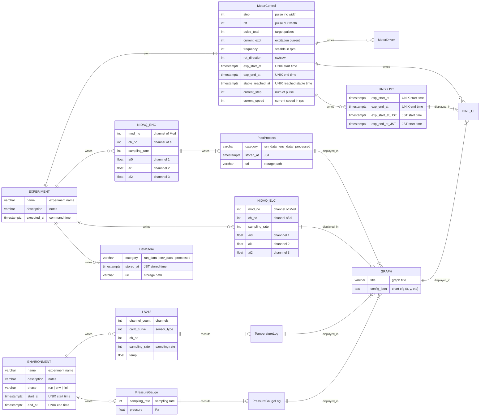

## 欲しい機能リスト

### 特に欲しい（岩垣）
- エンコーダAorBの波形から読み取った速度変化
- ドライバに出している速度指令値（Pythonのコードを元に）
- ドライバが実際に出している速度指令値（コネクタを取り付けて測定）

### できれば欲しい（岩垣）
- グリッパーの位置（開閉）を確認できるもの
- 測定している温度の変化のグラフ
- コイルの電流（U,V,W）のグラフ
- コイルの電圧（U,V,W）のグラフ
- エンコーダA,B,Zの生の波形

### 秋澤さん提案
- データをPDF,hdf5にして保存する機能（実験データ解析用）
- LabVIEWみたいに直感的に操作できるグラフ表示のUI
- SQL（試験ごとの条件をまとめて、実験データのDLもできるもの、Excelの代わり）
- ソフトトリガー

## 要件定義

### 機能要件
    - 
### 性能要件

- I/O
    - INPUT
        - SiPD DAQ
            - サンプリングレート: WRITE ME
            - 読み出し電圧レンジ : WRITE ME
            - 読み出しチャンネル数: WRITE ME
        - モーター電流 DAQ
            - サンプリングレート: WRITE ME
            - 読み出し電圧レンジ: WRITE ME
            - 読み出しチャンネル数: 3
        - モーター電圧 DAQ
            - サンプリングレート: WRITE ME
            - 読み出し電圧レンジ: WRITE ME
            - 読み出しチャンネル数: 3
        - 温度計 DAQ
            - サンプリングレート: WRITE ME
            - 読み出しチャンネル数: WRITE ME
    - OUTPUT
        - モータードライバコントロール
            - パラメータ
                - 励磁電流: 0 ~ 0.5 A
                - 初期電気角
                - 回転周波数: 0 ~ 5 Hz (5 rps)
                - 加速設定 (pulse per second, pps):
                    - 指令パルスインクリメント幅 (step): WRITE ME [pulse]
                    - 指令デュレーション幅 (rst): [s]
                    - 初期パルス
                - 回転方向: CW or CCW (回転方向とエンコーダー方向を定義せよ)
                - 回転前直流励磁
                    - 電流値: 0 ~ 0.5 A
                    - 時間: N/A
- データ処理
    - F/V変換
    - 
- UI
    - 画面構成
        - エンコーダー速度グラフ
        - 指令速度グラフ
        - 測定温度（クライオスタット+外部）
        - 圧力計
    - グラフ画面リフレッシュレート: WRITE ME
    - バッファーサイズ: WRITE ME
    - 画面保存機能
- データベース
    - RAWデータ
        - ファイルフォーマット: csv or HDF5?
    - 実験条件パラメータ
        - 励磁電流
        - 加速設定
        - 回転方向
        - 回転前直流励磁
    - 処理データ
        - エンコーダー速度データ
        - 指令速度データ
    - 時間:
        - UNIX時間（内部処理）とISO8601（UI）の相互型変換

- クロック: システムクロック
- ソフトウェアトリガー:
- Garbage collection

## 基本設計
### 機能一覧表

- 
- 

### 論理設計

